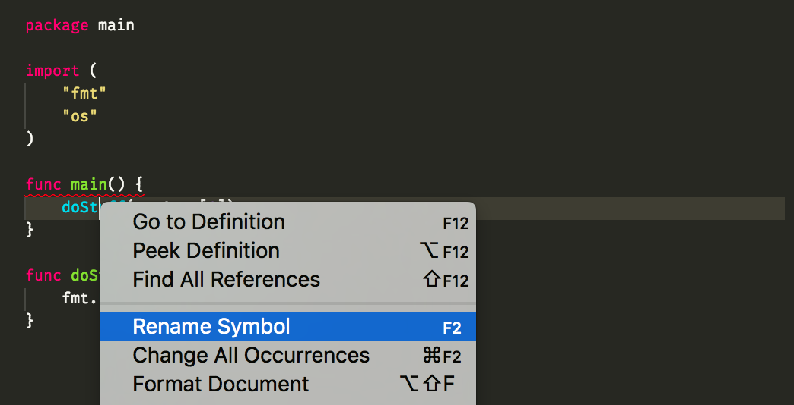
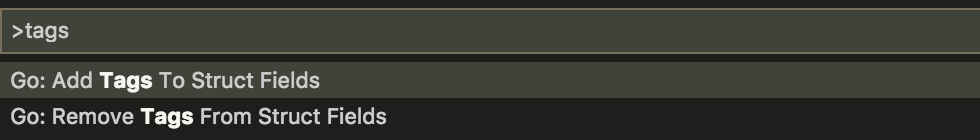
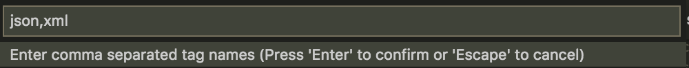
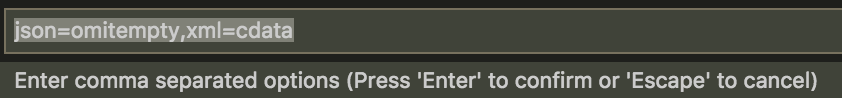

# Go tools that modify your code

During this chapter we're going to learn about some really useful tools that many
gophers use so often they might even forget they exist!

## `gofmt` and other formatting tools

Let's talk a bit about the history of this family of tools first.

### A bit of history

From very early on, the Go team decided that it was worth having a unified formatting
for all code. This was motivated mostly because at Google there are style guides for
each language covering all of the aspects of the language, including formatting
conventions such as how many spaces you should have in between a comment and the line
commented, or where should blank lines should be used.

Instead of writing one more style guide, the Go team decided that it would be much easier
to simply say all Go code should be formatted using the "go formatting" tool, known
as `gofmt`.

### Using `gofmt`

You can invoke `gofmt` from your command line, and by default it will read from standard
input some Go code, format it, and print the output to standard output.

In the following samples `main.go` contains the following code:

```go
package main
import "fmt"
func main() {
fmt.Println("hello") }
```

```bash
$ cat main.go | gofmt
package main

import "fmt"

func main() {
        fmt.Println("hello")
}
```

You can also invoke `gofmt` with the name of a file and the formatted version of it will be
printed to the standard output.

```bash
$ gofmt main.go
package main

import "fmt"

func main() {
        fmt.Println("hello")
}
```

We can also only print the diff between the input and the formatted output
by using the `-d` flag.

```diff
$ gofmt -d main.go
 package main
+
 import "fmt"
+
 func main() {
-fmt.Println("hello") }
+       fmt.Println("hello")
+}
```

And finally, you can rewrite a file in place, simply using the `-w` flag.

```bash
$ gofmt -w main.go
# no output expected, but main.go will be modifed.
```

Remember these ways of calling `gofmt`, because most of the tools that
we'll see in this chapter use the same calling conventions.

Finally, there's an easy way to format all the code in a package, simply use
the `fmt` subcommand in the `go` tool and the package to format:

```bash
$ go fmt .
main.go
```

The output contains the list of all the files that were modified.

#### Exercise: `gofmt` basics

Copy the original code of `main.go` above and modify it in the following ways:

- remove the last `}` from the code, what does `gofmt` do?
- what if you make the whole `main` function fit in a line?

### Integrating `gofmt` in your editor

By installing `vscode-go` on VSCode you've already got `gofmt` added as an on-save hook.
This means that every time you save your file `gofmt` will modify your code to match
the canonical format. This might seem annoying at first, but you will soon get used
to it, to the point that whenever `gofmt` doesn't change your code on save, you'll know
that somehow your code is not compiling.

Try writing some Go code on VSCode and see how the code changes as soon as you save.
Cool, right?

## More than formatting

Once gophers were used to having a tool change their code on save, many other tools appeared
that made our coding more efficient. Let's see some of them by order of popularity.

These tools differ from `gofmt` in that they modify your code from something that *almost*
compiles to valid source code.

### `goimports`: automating import statements

Go is very strict regarding missing or even unused import statements. This causes enough
annoyance to a part of the community that they decided to automate the management of
import statements.

`goimports` will remove import statements for any packages that are not used in the code.
Even cooler, `goimports` will also find references to packages that are not imported
and add them.

"How does this magic work?" you ask. It's quite straightforward. Given an expression such as
`fmt.Println`, `goimports` will find a package named `fmt` that exports an identifier named
`Println`. It adds the first one it finds. This means that in some cases you might end up
importing the wrong package, but this occurs so rarely that the tool is still very useful.

The search for packages is not done only over the standard library, but over your whole
`GOPATH`! This makes writing code very effective, but if your `GOPATH` contains a huge amount
of code, the first calls to `goimports` might be a bit slow, but the results are cached for
later invocations.

#### Exercise: `goimports`

Write some code using `fmt.Println` and see how the import statement is added automatically.
Then remove that invocation to `Println` and you should see the import statement disappear too.

What if you use [`template.Parse`](https://golang.org/pkg/text/template)? Would you expect to
import `text/template` or `html/template`?

Replace the `fmt.Println` in your code with `logrus.Infof` and save.
Do you see that new import path? If not, make sure you run `go get github.com/Sirupsen/logrus`.

Notice that `goimports` is a replacement of `gofmt`, since it *formats* the code and manages
the import statements.

# Fixing, renaming and other refactoring

So far we've seen tools that modify code that either doesn't compile or doesn't comply to some
formatting conventions. Those tools modify the input code without needing any extra directions
on how to do so.

Now we're going to cover those tools that modify code in order to perform fixes, renaming
variables, or other kinds of refactoring on code that already compiles.

## `go fix`

Whenever a big change happens to some package that many people use, most often a package
moves into the standard library, the next release of Go adds a new *fix* recipe to the
`go fix` tool.

Some of the current ones allow you to replace `golang.org/x/net/context` with `context`,
or `golang.org/x/tools/go/types` to `go/types`. More will come as the language evolves, but
these fixes were more common while the language was still actively changing.

## `gorename`

`gorename` provides renaming of identifiers in a type safe way across files and even packages.

Given the following code in [torename/main.go](torename/main.go):

[embedmd]:# (torename/main.go /package main/ $)
```go
package main

import (
	"fmt"
	"os"
)

func main() {
	doStuff(os.Args[1])
}

func doStuff(name string) {
	fmt.Println("hello,", name)
}
```

You can rename `doStuff` to a more appropriate name directly from your console:

```bash
$ gorename -from torename/main.go::doStuff -to greet
Renamed 2 occurrences in 1 file in 1 package.
```


Or alternatively you can use a contextual menu by clicking on one of the occurrences
of `doStuff` on VSCode.



If you modify an exported identifier `gorename` needs to analyze all the code in
your `GOPATH` looking for code that needs to be refactored, so do not expect a
quick result.

## `gomodifytags`

Some packages in the standard library, such as `encoding/json` and `encoding/xml`,
use struct field tags as a way to provide information on how a struct should
be encoded. For instance given the code in [tags/main.go](tags/main.go):

[embedmd]:# (tags/main.go /package main/ $)
```go
package main

import (
	"encoding/json"
	"log"
	"os"
)

// Person contains information about people.
type Person struct {
	Name string
	Age  int
}

func main() {
	err := json.NewEncoder(os.Stdout).Encode(Person{"Gopher", 6})
	if err != nil {
		log.Fatal(err)
	}
}
```

You could specify that the `json` encoding for the field `Name` should use lower
case names by modifying the definition of `Person` to be:

```go
type Person struct {
    Name string `json:"name"`
    Age  int
}
```

Writing these tags is repetitive and error prone (worts part is that the compiler
will not catch these errors), so a tool was written specifically for this too.

You can make `Name` and `Age` appear as `name` and `age` in the JSON output by
running `gomodifytags`:

```bash
$ gomodifytags -file tags/main.go -add-tags json -struct Person
package main

import (
        "encoding/json"
        "os"
)

type Person struct {
        Name string `json:"name"`
        Age  int    `json:"age"`
}

func main() {
        json.NewEncoder(os.Stdout).Encode(Person{"Gopher", 6})
}
```

You can also, as usual, add the `-w` flag to rewrite the original file.

In VSCode you can also do this by opening the Command Palette (command + P on Mac),
finding the command named "Go: Add Tags To Struct Fields"



You'll need to provide what kind of struct tags you want to add.



Then finally whatever options you might want to add.



The resulting file should contain a `Person` type that looks like this:

```go
type Person struct {
	Name string `json:"name,omitempty" xml:"name,cdata"`
	Age  int    `json:"age,omitempty" xml:"age,cdata"`
}
```

## `eg`

`eg` is an example-based refactoring tool.
To use it, you simply create a template file and then provide the paths you wish to refactor.
`eg` is particulary useful for changing function or API usages.

### Installing `eg`

```bash
$ go install golang.org/x/tools/cmd/eg
```

### Writing a template

Here's a simple template (`template.go`) to get you started.
Templates need to be buildable Go files with `before` and `after` functions.

[embedmd]:# (eg-content/template.go)
```go
package template

import (
	"errors"
	"fmt"
)

func before(s string) error { return fmt.Errorf("%s", s) }
func after(s string) error  { return errors.New(s) }
```

### Running `eg`

We have a file called `target.go` with the following contents:

[embedmd]:# (eg-content/target.go)
```go
package main

import "fmt"

func main() { fmt.Printf("Error: %v", fmt.Errorf("%s", "Whoops!")) }
```

We can use `eg` to create the refactoring of `target.go` using `template.go`.
In the command, we use the `-t` flag to denote the template filename.

```bash
# output the refactored target.go to result.go
$ eg -t template.go target.go > result.go
=== .../target.go (1 matches)
```

And voila, `result.go`:

[embedmd]:# (eg-content/result.go)
```go
package main

import (
	"errors"
	"fmt"
)

func main() { fmt.Printf("Error: %v", errors.New("Whoops!")) }
```

Add the `-w` flag to write the file(s) in place instead of the default dry-run.

## And more!

New editing tools appear often, some of them have value to the general population
and others are more specific to some niche part of the community.

Maybe you can come up with a new tool that makes your workflow better, go for it!
But before make sure that it doesn't exist already, as the list we've seen is far
from exhaustive.

## Congratulations!

You now know how to integrate and use the most common editing tools for gophers.
Next, let's see how tools can also help you detect mistakes in your code early on
with the [next section](3-vet-and-lint.md).
