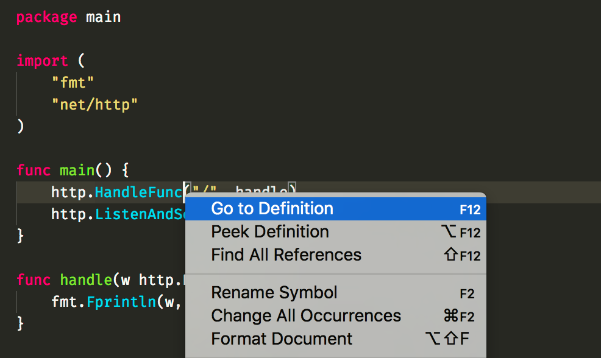
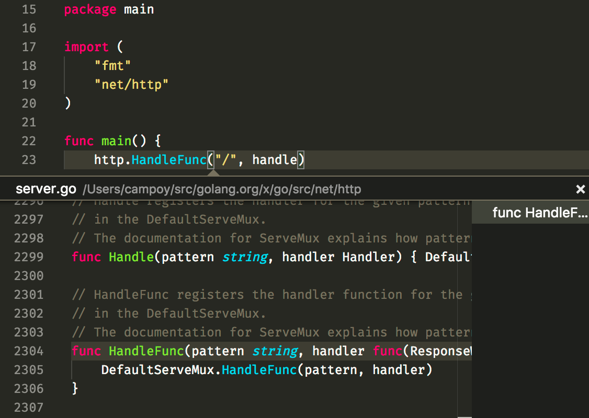

# Tools for navigating code

Source code in any language is a very rich structure with many links
forward and backwards, every variable usage, every function call,
refers to some object defined somewhere in the code base.

Navigating this with the help of just `grep` or any other text search
is far from optimal, but some tools exist specifically for this.

## godef

`godef` allows you to navigate those links in a specific direction,
given a usage of a variable, function, or any other identifier, it
is able to tell use where that symbol was declared in the code base.

You can run it directly from the command line:

```bash
$ godef -f main.go http.HandleFunc
/Users/campoy/src/golang.org/x/go/src/net/http/server.go:2304:6
```

The output is the file, line, and column where `http.HandleFunc` was
declared.

Although you can use `godef` directly, most of the time you'll use
it directly from your editor by clicking on `Go to Definition`.



It's also useful to use `Peek Definition` to see the code without
leaving the current context.



## guru

[guru](https://godoc.org/golang.org/x/tools/cmd/guru) is an incredibly powerful
tool, allowing you to navigate your code in many different ways.

It allows you to find all the references to a given symbol (which VSCode exposes
as a contextual menu), but also it allows you to find all the callers of a given
function, or what possible values a given variable can have.

It is very powerful, but unfortunately VSCode does not integrate very well with it.
If you want to have a look at what a good integration for this looks, check
[vim-go](https://github.com/fatih/vim-go) out.

You can see a little demo of what `vim-go` is able to do [here](http://quick.as/k7osbzp).

## sourcegraph

Navigating source code in your machine is important, but navigatint source code
that is public on the internet can also be essential. Fortunately there's a cool
startup that is working on this problem. And guess what, they use a lot of Go!

I definitely recommend installing the [sourcegraph](https://about.sourcegraph.com/)
[Chrome extension](https://chrome.google.com/webstore/detail/sourcegraph-for-github/dgjhfomjieaadpoljlnidmbgkdffpack?hl=en)
and give it a try. Simply navigate GitHub repos and see how
awesome it is to be able to `jump to definition` from your browser!

_Note_: I do not make any money by promoting sourcegraph, I just think they're awesome!

## Congratulations

You now know how to manage your workspace, write code that has no
bugs (or at least not too many), and analyze and navigate any code
base that you might find.

What's the next step? Well, we should start compiling that code!
Let's do that now, with the [next section](../../2-building-artifacts/1-go-build.md).
