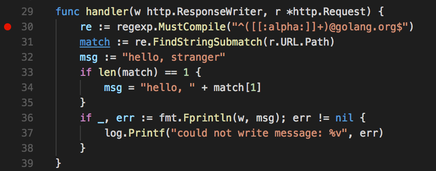
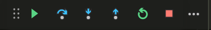

# Debugging Go programs with delve

For quite a long time people asked for a good debugger for Go.
GDB works, but it doesn't really understand Go routines and that causes complications
when debugging Go programs as soon as they start to get a bit complicated.

Luckily, the Go community provided a new debugger called [delve](https://github.com/derekparker/delve).
If you haven't installed it yet, please follow [these instructions](https://github.com/derekparker/delve/tree/master/Documentation/installation)
before continuing.

We will debug the web server implemented in the [webserver](../webserver) directory under `3-dynamic-analysis`.
It's a very simple web server that checks the path of the HTTP request and it
prints `hello, foo` if the path was something like `localhost:8080/foo@golang.org`,
and `hello, stranger` otherwise.

Try it now. It might not work ... and that's ok. Do not fix it just yet!

## Debugging the webserver

To start the `webserver` program simply visit the directory with your terminal
and run:

```
$ dlv debug
Type 'help' for list of commands.
(dlv)
```

This command will compile the current package and generate a binary that can be
debugged correctly. It is out of the scope of this workshop to explain how this
really works.

If you try to visit the http://localhost:8080 you will see that the server is not running.
This is normal, since our binary was loaded but not executed yet! Let's make it run by
typing `continue`.

```
$ dlv debug
Type 'help' for list of commands.
(dlv) continue
```

Try visiting http://localhost:8080 again and you should be able to try the webserver.
Visit now http://localhost:8080/campoy@golang.org, it should show `hello, campoy`.
Does that work?

It's time to debug! Let's stop the execution by typing `ctrl+c` on the delve console.
This will stop the execution at some point, we do not really care exactly where.

We can now set a breakpoint so whenever the function `handler` is executed we can see
what is going on. Then we continue with the execution.

```
(dlv) break main.handler
Breakpoint 1 set at 0x1226d88 for main.handler() ./main.go:29
(dlv) continue
```

If now you visit http://localhost:8080/campoy@golang.org the debugger will stop
the execution and show you where it stopped.

```
(dlv) continue
> main.handler() ./main.go:29 (hits goroutine(6):1 total:1) (PC: 0x1226d88)
    24: func main() {
    25:         http.HandleFunc("/", handler)
    26:         log.Fatal(http.ListenAndServe(":8080", nil))
    27: }
    28:
=>  29: func handler(w http.ResponseWriter, r *http.Request) {
    30:         re := regexp.MustCompile("^([[:alpha:]]+)@golang.org$")
    31:         match := re.FindStringSubmatch(r.URL.Path)
    32:         msg := "hello, stranger"
    33:         if len(match) == 1 {
    34:                 msg = "hello, " + match[1]
```

Great, it's on line 29 right at the beginning of the `handler` function.
Now you can use `print` to show the values of the variables available at
that point of the program.

Try printing the `http.Request`, you can even see all the headers!

You can go step by step in the execution by running `next`.

### Exercise: debugging with the delve console

Using `next` and `print` try to figure out why `FindStringSubmatch` is
returning an empty match.

If you want to see the solution, expand the `details` section below.

<details>

You can run `next` until you get to line 32, or alternatively set a breakpoint
on that line and run `continue`.

```
(dlv) break main.go:32
Breakpoint 2 set at 0x122461c for main.handler() ./main.go:32
```

```
(dlv) print match
[]string len: 0, cap: 0, []
```

Why is that empty? Well, we're matching an something with just letters and then
`@golang.org`, but what is really `r.URL.Path`?

```
(dlv) print r.URL.Path
"/campoy@golang.org"
```

The path starts with `/`! Let's remove it by simply changing `r.URL.Path` with
`r.URL.Path[1:]`.

</details>

## Using delve from VSCode

Using delve from the console seems quite useful, but VSCode offers a great
integration too. Let's see how that works.

First open [webserver/main.go](../webserver/main.go) on VSCode.

You can set up breakpoints by clicking left from a line number.



To start running the process you need to first open the debug panel
by clickin on the <image src="debug.png" height=20px> symbol, or `command+D`. Then press the green play (▶) button and if requested
select Go from the list of languages.

Your server is now running, and if you visit http://localhost:8080/campoy@golang.org
you will see how VSCode shows the program reached the breakpoint we set.


Now you can hover over any of the variables to show their value! And for more complicated
expressions you can also use the debug console at the bottom of the editor. Type
`r.URL.Path` in there, and you'll see its value.

Alternatively, you can also modify your user settings to set `"debug.inlineValues"` to `true`,
so you'll be able to see inline the values of the variables as you assign them.

To control the execution you can now use the debug menu displayed below instead of typing
`next`, `continue`, etc.



## Exercise: debugging with VSCode and delve

In the previous exercise we fixed a problem with the path in the URL, but there's still
one more issue, try to figure out why http://localhost:8080/campoy@golang.org still prints
`hello, stranger` instead of `hello, campoy` by setting up breakpoints and investigating
the values of the variables in the scope.

<details>

It turns out that `FindStringSubmatch` returns a slice of strings with all the groups
that were matched by the regular expression. In our case there's only one group
`([[:alpha:]]+)`, but the first element of the slice is the full string we passed to the
function. This means that the length of `match` will never be 1! It will be either 0 or 2.

</details>

## Congratulations

You're a master of delve! Seriously, there's not much more to learn about debuggers and this
will help you figure out why your code behave mysteriously.

But as we say at Google ["testing rocks, debugging sucks!"](https://docs.google.com/presentation/d/1tahi9BSW8wR3R2DWTRp4eH0ZmZQFpYvEjAby942EykE/edit#slide=id.i0),
so let's stop debugging and learn how to test with the [next chapter](../2-testing/1-go-test.md).
