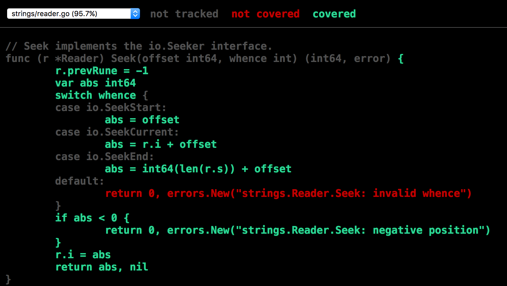
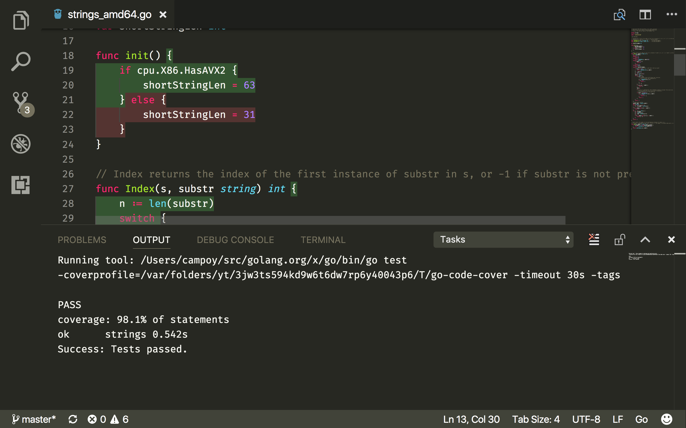

# Code Coverage

Code coverage measures the percentage of lines of code that are executed while
running a suite of tests.

It is a useful indicator to identify the areas of your code that have not
been tested. But I do not recommend using it as a target of quality, since 100%
code coverage does not imply (at all!) that your code is fully tested or bug
free.

Even if far from perfect it's a useful metric, so let's learn how to obtain the
code coverage for a suite of tests. For a longer explanation of the tool
I'd recommend reading the blog post [The cover story](https://blog.golang.org/cover).

## go test -cover

That's it, really. Simply add `-cover` to your `go test`:

```bash
$ go test -cover strings
ok      strings 0.283s  coverage: 97.8% of statements
```

This metric is helpful but doesn't show us which lines are covered at all.
The document that shows how often each line of code is ran during a test
suite is called coverage profile, and that's the name of the flag we'll use
to obtain it.

```bash
$ go test -coverprofile coverage.out strings
ok      strings 0.276s  coverage: 97.8% of statements
```

After executing this you will see a `coverage.out` file containing how many
times each line was executed.

```bash
$ head coverage.out
mode: set
strings/compare.go:13.31,21.12 1 1
strings/compare.go:24.2,24.11 1 1
strings/compare.go:27.2,27.11 1 1
strings/compare.go:21.12,23.3 1 1
strings/compare.go:24.11,26.3 1 1
strings/reader.go:24.28,25.28 1 1
strings/reader.go:28.2,28.35 1 1
strings/reader.go:25.28,27.3 1 1
strings/reader.go:35.31,35.57 1 1
```

This is the file you want to use to integrate other tools. But to understand
the result of this coverage profile we will use the `cover` tool:

```bash
$ go tool cover -html=coverage.out
```

This will open a browser with the coverage profile where the lines of code that
have been executed appear in green, while those that were not used appear in red.



If you want to see not only *whether* a line of code was executed, but also
how often it was ran you can use `-covermode=count`:

```bash
$ go test -covermode=count -coverprofile=coverage.out strings
ok      strings 0.301s  coverage: 97.8% of statements

$ head -5 coverage.out
mode: count
strings/compare.go:13.31,21.12 1 16653
strings/compare.go:24.2,24.11 1 16520
strings/compare.go:27.2,27.11 1 8260
strings/compare.go:21.12,23.3 1 133

$ go tool cover -html=coverage.out
```

This will display now a subtle coloring from dark to bright green for the
least to most executed lines of code.


### Exercise: code coverage

Measure the code coverage for the [sum](sum) package from the previous
chapter. Generate an HTML report and identify what lines have not been
executed. Can you add test cases to reach 100%?

Try also generating a report showing how often each line of code is
executed.

## Code coverage with VSCode

As always, our friends at Microsoft integrated this useful tool on VSCode.
To see the code coverage of a test suite simply open the command palette
and execute `Go: Toggle Test Coverage in Current Package`. This will run
all the tests in the current package and display the result directly in
the editor.



## Congratulations

You are now able to monitor the code coverage of your test suite! This
is very useful, and something that most package maintainers display
proudly on their `GitHub` pages!

But how do they do that? How do they keep an updated analysis of their
test results and their coverage? They use continuous integration tools,
and that's what we'll learn on the [next chapter](3-continuous-integration.md).
