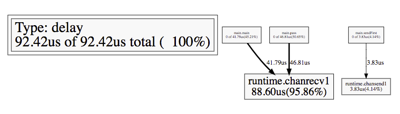
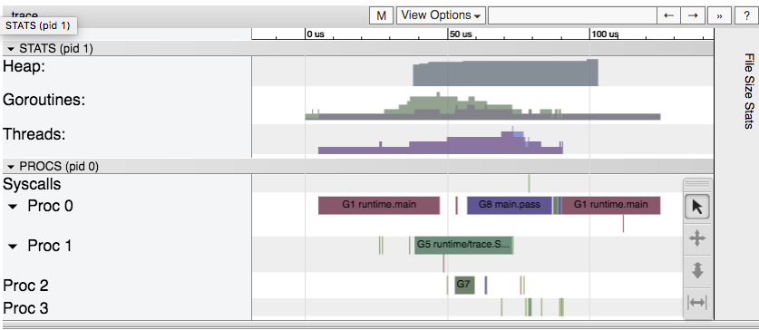
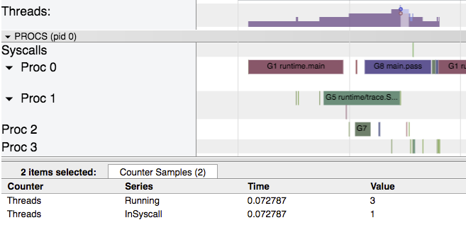
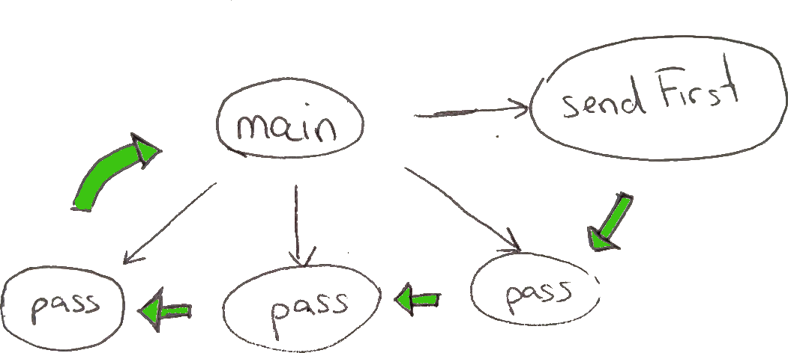
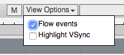
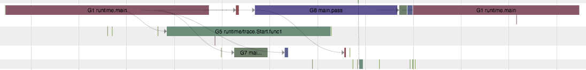

# Tracing Go programs

In Go 1.5, a new tool was added to Go: the execution tracer.
In this chapter we will learn what the tracer does and how it can
help us pin point performance issues in our programs.

Unlike `pprof` which, as we saw before checks what a Go program is
currently executing, the execution tracer makes the Go runtime
take the initiative of reporting each time an event occurs.
These events can be creation of goroutines, system calls, changes
of heap size, and many more. Each time one of these events occurs
it is reported with its timestamp and a stack trace for most events.

The result of executing a program with the Go Execution Tracer enabled
is a pretty big binary file that can be analyzed with  `go tool trace`.

## A first example

The awesome thing about the Go execution tracer is that it doesn't require
to run for long, so we can start by understanding what a program does by
simply adding calls to `trace.Start` and `trace.Stop`.

[embedmd]:# (daisy/main.go /package main/ /trace.Stop.*/)
```go
package main

import (
	"log"
	"os"
	"runtime/trace"
)

func main() {
	_ = trace.Start(os.Stdout)
	defer trace.Stop()
```

So, without reading anything else in the code, let's simply run the code and
store the trace output.

```bash
$ go run daisy/main.go > trace.out
3
$ go tool trace trace.out
2017/07/10 17:47:47 Parsing trace...
2017/07/10 17:47:47 Serializing trace...
2017/07/10 17:47:47 Splitting trace...
2017/07/10 17:47:47 Opening browser
```

This will open a browser with a series of links, let's click on `Goroutine
analysis`, you should see something like this:

```
Goroutines: 
runtime.main N=1 
main.pass N=3 
runtime/trace.Start.func1 N=1 
main.sendFirst N=1 
N=3 
```

Ok, so we have 5 goroutines total, one running `main`, one running `pass`,
and one running `sendFirst`. There's also one running the tracer.

If we click on the `Synchronization blocking profile` you should see an
interesting graph.



It seems both `main` and `pass` spend a considerable fraction of time trying
to receive from a channel.

Let's now click on `View trace` for now.
You should see something like this:



Ok, so we can already see a lot of information in here! Let's start by the number of
threads. Click anywhere on the `Threads` row of the graphic and you should see how many
threads you were running at that point.



In this case we see that there are four threads, and one of them is used for a system call.

Similarily you can click on the `Goroutines` row and have an idea of how many goroutines
existed at each point of the program.


It seems we have four, two of them running, and none of them are blocked by the garbage
collector.

Wow! We were able to understand *many* things from the program even before
we read a single line of code! But now it's time to read the code to be
able to interpret better what's going on.

[embedmd]:# (daisy/main.go /package main/ $)
```go
package main

import (
	"log"
	"os"
	"runtime/trace"
)

func main() {
	_ = trace.Start(os.Stdout)
	defer trace.Stop()

	const n = 3

	leftmost := make(chan int)
	right := leftmost
	left := leftmost

	for i := 0; i < n; i++ {
		right = make(chan int)
		go pass(left, right)
		left = right
	}

	go sendFirst(right)
	log.Println(<-leftmost)
}

func pass(left, right chan int) {
	v := 1 + <-right
	left <- v
}

func sendFirst(ch chan int) { ch <- 0 }
```

This code is creating a chain of goroutines connected through channels, then sending a
value on one end and waiting for the value to be received on the other end.



Now that we know this, let's go back to the trace viewer and analyze the dependencies.
Enable the visualization of `Flow Events` by ticking it on `View Options`.



Spend some time navigating the graph of dependencies and try to see how each goroutine
synchronizes with others via the channels.



## Exercise: an mysterious trace

Analyze this mysterious trace given on [mistery.trace](mistery.trace).

```bash
$ go tool trace mistery.trace
```

What do you think it does? How many goroutines are there?

Can you see any garbage collection going on?

Once you're ready to discovery the misterious code click on `details`.

<details>

The misterious trace belongs to an execution of [ping-pong/main.go](ping-pong/main.go).

[embedmd]:# (ping-pong/main.go /package main/ $)
```go
package main

import (
	"log"
	"os"
	"runtime/trace"
	"time"
)

func main() {
	_ = trace.Start(os.Stdout)
	defer trace.Stop()

	table := make(chan int)
	go player(table, "ping")
	go player(table, "pong")

	table <- 0
	time.Sleep(time.Second)
	ball := <-table
	close(table)
	log.Printf("played %d turns", ball)

	// runtime.GC()
	// _ = pprof.WriteHeapProfile(os.Stdout)
}

func player(table chan int, name string) {
	for ball := range table {
		log.Printf("%d\t%s", ball, name)
		table <- ball + 1
	}
}
```

That's an interesting program. If you feel like it, maybe it's worth using `pprof`
to analyze where the memory is being allocated.

</details>

## Exercise: explore your options

Modify the program and analyze the resulting trace:

- add `time.Sleep` inside of `pass`
- increase the number of goroutines created
- run the program with `GOMAXPROCS=1`

Try to find other cool modifications that change the trace.

## Congratulations


This is the end of the workshop, so now there's only [one more step](../../congratulations.md).
